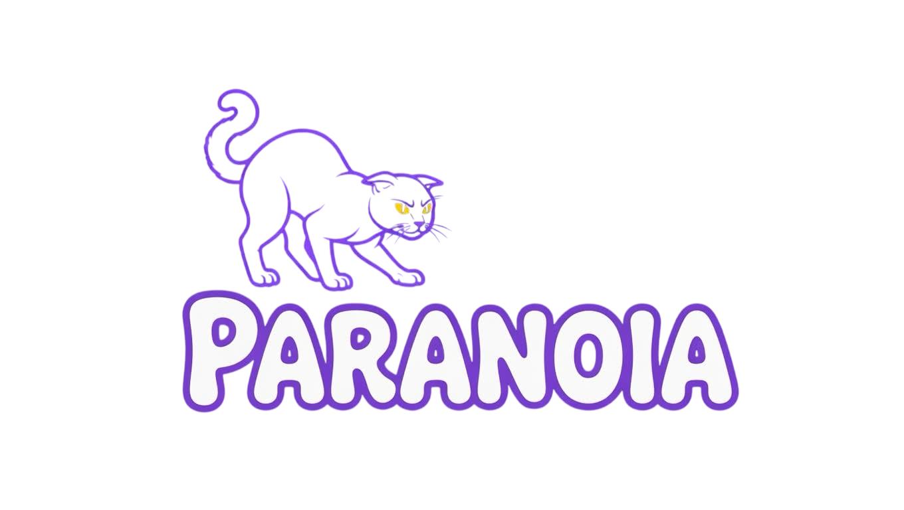

<div align="center">



<br/>

[](https://git.io/typing-svg)

<br/>


</div>

<br/>

```
╔══════════════════════════════════════════════════════╗
║                    [ SYSTEM BIO ]                    ║
╚══════════════════════════════════════════════════════╝
```

Developer from **Germany** building software for VRChat and the people who live in it.
I focus on tooling that works, UIs that feel right, and shipping things that matter.

<br/>

```
╔══════════════════════════════════════════════════════╗
║                   [ TECH STACK ]                     ║
╚══════════════════════════════════════════════════════╝
```

<div align="center">


</div>

<br/>

```
╔══════════════════════════════════════════════════════╗
║                   [ OPERATIONS ]                     ║
╚══════════════════════════════════════════════════════╝
```

**🐱 Parano!a OSC**
> VRChat chatbox tool — system stats, media, AFK, rotating messages and more, sent directly to your VRChat chatbox via OSC. Built with C# / WPF / WebView2, deployed on Cloudflare.

[](https://discord.gg/paranoiaosc)

<br/>

```
╔══════════════════════════════════════════════════════╗
║                     [ STATS ]                        ║
╚══════════════════════════════════════════════════════╝
```

<div align="center">


</div>

<br/>


